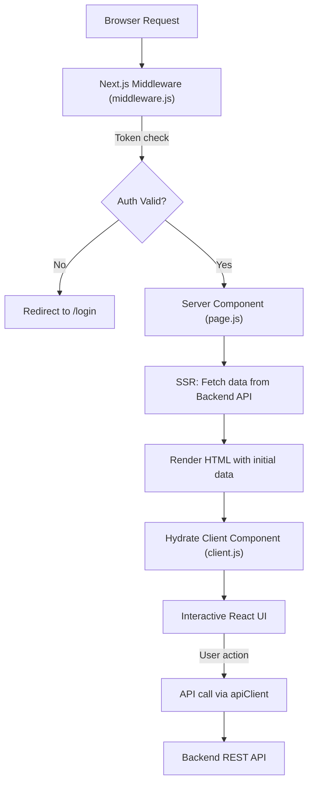

# SlashCRM Frontend — Technical Documentation

**Version:** 0.1.0  
**Framework:** Next.js 16 (App Router)  
**Last Updated:** April 2026  
**Prepared by:** Engineering Team

---

## Table of Contents

1. [Project Overview](#1-project-overview)
2. [Technology Stack](#2-technology-stack)
3. [Project Structure](#3-project-structure)
4. [Architecture Overview](#4-architecture-overview)
5. [Authentication System](#5-authentication-system)
6. [Routing & Middleware](#6-routing--middleware)
7. [API Layer](#7-api-layer)
8. [Application Layout System](#8-application-layout-system)
9. [Module: Dashboard](#9-module-dashboard)
10. [Module: Leads (Lead Page)](#10-module-leads-lead-page)
11. [Module: User Management](#11-module-user-management)
12. [Module: Gene Management](#12-module-gene-management)
13. [Module: Forms & Custom Forms](#13-module-forms--custom-forms)
14. [Module: Activities](#14-module-activities)
15. [Module: Migrator](#15-module-migrator)
16. [Module: Reports & Settings](#16-module-reports--settings)
17. [UI Component System](#17-ui-component-system)
18. [Design System & Theming](#18-design-system--theming)
19. [Global Search](#19-global-search)
20. [State Management Patterns](#20-state-management-patterns)
21. [Performance Optimizations](#21-performance-optimizations)
22. [Configuration & Environment Variables](#22-configuration--environment-variables)
23. [Deployment & Build](#23-deployment--build)
24. [Security Considerations](#24-security-considerations)

---

## 1. Project Overview

**SlashCRM** is a full-featured, enterprise-grade Customer Relationship Management (CRM) system built for [SlashRTC](http://10.10.15.194). The frontend is a **Next.js 16 App Router** application providing a rich, responsive interface for managing leads, users, organizations, activities, custom forms, data migration, and permissions.

### Key Capabilities

| Capability | Description |
|---|---|
| **Lead Management** | Dynamic lead tables with cursor-based pagination, filters, sorting, and stage progression |
| **User & Role Management** | Full CRUD for users, roles, policies, and permission mappings |
| **Gene Management** | Hierarchical permission gene system with feature and policy mapping |
| **Custom Forms** | Drag-and-drop form builder linked to dynamic data tables |
| **Activities** | CRM activity tracking (calls, meetings, emails, tasks) |
| **Data Migrator** | CSV/database migration tool with real-time progress tracking |
| **Reports** | Organization-wide reporting and analytics |
| **Global Search** | Command-palette-style search (`Ctrl+K`) across all pages |
| **Dark Mode** | Full light/dark theme toggle |

---

## 2. Technology Stack

### Core

| Technology | Version | Purpose |
|---|---|---|
| **Next.js** | ^16.1.0 | Full-stack React framework (App Router) |
| **React** | ^19.2.3 | UI rendering |
| **React DOM** | ^19.2.3 | DOM binding |

### Styling

| Technology | Version | Purpose |
|---|---|---|
| **Tailwind CSS** | ^4 | Utility-first CSS |
| **tw-animate-css** | ^1.4.0 | Animation utilities |
| **tailwind-merge** | ^3.3.1 | Class merging |
| **class-variance-authority** | ^0.7.1 | Component variant management |

### UI Components

| Library | Version | Purpose |
|---|---|---|
| **@radix-ui/\*** | Various | Headless, accessible primitives |
| **lucide-react** | ^0.544.0 | Icon library |
| **sonner** | ^2.0.7 | Toast notification system |
| **cmdk** | ^1.1.1 | Command palette |
| **embla-carousel-react** | ^8.6.0 | Carousel component |
| **react-day-picker** | ^9.11.0 | Date picker |

### Data & Forms

| Library | Version | Purpose |
|---|---|---|
| **axios** | ^1.12.2 | HTTP client with interceptors |
| **@tanstack/react-table** | ^8.21.3 | Headless table management |
| **@tanstack/react-form** | ^1.23.4 | Form state management |
| **recharts** | ^2.15.4 | Charts and data visualization |
| **reactflow** | ^11.11.4 | Node-based flow diagrams |
| **date-fns** | ^4.1.0 | Date utility functions |
| **uuid** | ^13.0.0 | UUID generation |

### Drag & Drop

| Library | Version | Purpose |
|---|---|---|
| **@dnd-kit/core** | ^6.3.1 | Drag-and-drop core |
| **@dnd-kit/sortable** | ^10.0.0 | Sortable lists |
| **@dnd-kit/utilities** | ^3.2.2 | DnD utility helpers |

### Fonts

- **Poppins** (Google Fonts) — loaded via `next/font/google` with all weights (100–900)

---

## 3. Project Structure

```
SlashCRM-Frontend/
├── app/                          # Next.js App Router root
│   ├── layout.js                 # Root server layout
│   ├── client-layout.js          # Client layout wrapper (sidebar + topbar)
│   ├── globals.css               # Global styles & design tokens
│   ├── page.js                   # Root redirect page
│   │
│   ├── api/                      # Next.js API Route Handlers
│   │   └── auth/
│   │       ├── login/
│   │       ├── logout/
│   │       ├── register/
│   │       ├── refresh/          # Token refresh proxy
│   │       ├── verify-otp/
│   │       ├── resend-otp/
│   │       └── proxy-backend/
│   │
│   ├── dashboard/                # Dashboard module
│   │   ├── page.js               # Server component (SSR data fetch)
│   │   └── client.js             # Client component (charts, UI)
│   │
│   ├── leadPage/                 # Lead management module
│   │   ├── page.js               # Server component
│   │   ├── client.js             # Client with table selector
│   │   ├── components/
│   │   │   ├── table-data-view.js  # 3800-line lead data view
│   │   │   ├── TableCard.jsx
│   │   │   ├── StatCard.jsx
│   │   │   ├── StatusBadge.jsx
│   │   │   ├── EmptyState.jsx
│   │   │   └── LeadPageSkeleton.jsx
│   │   └── record-details/       # Individual lead record details
│   │
│   ├── users/                    # User management module
│   │   ├── page.js
│   │   ├── client.js
│   │   ├── hooks/
│   │   └── components/
│   │       ├── user-table.js
│   │       ├── user-dialogs.js
│   │       ├── user-filters.js
│   │       └── user-stats.js
│   │
│   ├── gene/                     # Gene management
│   ├── geneManagement/
│   ├── feature/                  # Feature management
│   ├── roles/                    # Role management
│   ├── organizations/            # Organization management
│   ├── permissionManagementSystem/
│   │
│   ├── forms/                    # Public form rendering
│   ├── custom-form/              # Form builder
│   ├── my-forms/                 # User's form list
│   ├── form-analytics/           # Form submission analytics
│   ├── form-submissions/
│   │
│   ├── activities/               # CRM activities
│   ├── strategy/                 # Lead strategy configuration
│   ├── migrator/                 # Data migration tool
│   ├── custom-table-builder/     # Schema builder
│   ├── report/                   # Reports
│   ├── profile/                  # User profile
│   ├── setting/                  # Application settings
│   ├── login/                    # Authentication pages
│   ├── register/
│   │
│   └── proxy/                    # Backend proxy utilities
│
├── components/
│   ├── layout/
│   │   ├── sidebar.js            # Collapsible sidebar navigation
│   │   └── topbar.js             # Top navigation bar
│   ├── records/
│   │   └── RecordModal.jsx       # Reusable record view/edit modal
│   ├── ui/                       # shadcn/ui components
│   ├── global-search.js          # Command palette search
│   ├── page-breadcrumb.jsx       # Breadcrumb navigation
│   └── protected-route.js        # Client-side auth guard
│
├── lib/
│   ├── api-client.js             # Axios instance + interceptors
│   ├── api-endpoint.js           # All URL definitions + API functions
│   ├── auth-utils.js             # Auth state management (cookie + localStorage)
│   ├── utils.js                  # Utility functions (37KB)
│   └── constants/
│
├── middleware.js                 # Next.js edge middleware
├── next.config.mjs               # Next.js configuration
├── package.json
└── ecosystem.config.js           # PM2 process manager config
```

---

## 4. Architecture Overview

SlashCRM follows a **hybrid rendering** model combining Next.js Server Components for data-heavy initial loads and React Client Components for interactive UI.

### Rendering Model



### Layered Architecture

```
┌─────────────────────────────────────┐
│   Presentation Layer (React/JSX)    │  ← UI components, pages
├─────────────────────────────────────┤
│   State Layer (React hooks/state)   │  ← useState, useCallback, useMemo
├─────────────────────────────────────┤
│   API Layer (lib/api-endpoint.js)   │  ← Typed API functions per resource
├─────────────────────────────────────┤
│   HTTP Layer (lib/api-client.js)    │  ← Axios + request/response interceptors
├─────────────────────────────────────┤
│   Auth Layer (lib/auth-utils.js)    │  ← Tokens in cookies, user in localStorage
└─────────────────────────────────────┘
```

### Data Flow Pattern

Each major module follows a consistent **Server + Client** split:

- **`page.js`** — `async` Server Component. Reads cookies server-side, fetches initial data from backend, passes serializable props to `client.js`.
- **`client.js`** — `"use client"` component. Receives server-supplied initial data, manages local state, and handles all interactive operations (CRUD, search, pagination).

This pattern enables fast First Contentful Paint (FCP) with SSR while keeping interactions fully client-side.

---

## 5. Authentication System

The authentication system spans three layers: **Edge Middleware**, **Next.js API Route Handlers**, and **client-side `auth-utils.js`**.

### 5.1 Token Storage Strategy

| Data | Storage Location | Purpose |
|---|---|---|
| `accessToken` | Cookie (1 day) | Short-lived bearer token for API calls |
| `refreshToken` | Cookie (7 days) | Long-lived token for silent re-authentication |
| `organization_id` | Cookie (7 days) | Available server-side for SSR data fetches |
| User object (full) | `localStorage` | Client-side user profile, features, g_ids, p_ids |

**Why this split?** Cookies are readable by Next.js middleware and Server Components (for SSR), while `localStorage` holds richer user data only needed on the client side. This avoids passing large user JSON through cookies for every HTTP request.

### 5.2 `auth-utils.js` Public API

```javascript
import { authUtils } from '@/lib/auth-utils'

// Store tokens after login
authUtils.setTokens({ accessToken, refreshToken, user })

// Read current tokens/user
authUtils.getTokens()         // → { accessToken, refreshToken, user }
authUtils.getUser()           // → user object from localStorage
authUtils.isAuthenticated()   // → boolean

// Derived helpers
authUtils.getOrganizationId() // → orgId (localStorage → cookie fallback)
authUtils.getGId()            // → first gene ID
authUtils.getGIds()           // → all gene IDs array
authUtils.getPIds()           // → policy IDs array
authUtils.getAuthHeader()     // → "Bearer <accessToken>"

// SSR helpers (server components only)
authUtils.getServerHeaders(cookieStore)         // → { Authorization, ... }
authUtils.getServerOrganizationId(cookieStore)  // → orgId from cookie

// Token lifecycle
authUtils.refreshToken()      // → calls /api/auth/refresh, stores new tokens
authUtils.logout()            // → calls /api/auth/logout, clears all storage
authUtils.clearTokens()       // → clears cookies + localStorage
```

### 5.3 Token Refresh Flow

The refresh logic is implemented at two levels:

**Client-side (Axios Interceptors — `api-client.js`):**

1. **Proactive refresh** — Before a request, if `accessToken` is missing but `refreshToken` exists, automatically refresh *before* sending the request.
2. **Reactive refresh** — On a 401 response, retry the failed request after refreshing the token.
3. **Queue management** — While refreshing, all concurrent requests are queued via `failedQueue`. Once the refresh completes, all queued requests are replayed with the new token.

**Server-side (`auth-utils.executeWithRefresh`):**

Used in Server Components where Axios interceptors are not available. Executes a `fetchCallback`, detects a 401 response, performs a server-side refresh, then retries:

```javascript
const { result, newAccessToken } = await authUtils.executeWithRefresh(
  cookieStore,
  async (headers) => fetch(url, { headers })
)
```

### 5.4 Next.js API Route Handlers (Auth Proxy)

The frontend acts as a **proxy** for authentication endpoints, forwarding requests to the backend and setting cookies via `NextResponse`:

| Route | Method | Description |
|---|---|---|
| `/api/auth/login` | POST | Login + set auth cookies |
| `/api/auth/register` | POST | Registration |
| `/api/auth/refresh` | POST | Token refresh + set new cookies |
| `/api/auth/verify-otp` | POST | OTP verification |
| `/api/auth/resend-otp` | POST | Resend OTP |
| `/api/auth/logout` | POST | Clear session |
| `/api/auth/proxy-backend` | POST | Generic backend proxy |

The `refresh` route handler sets `accessToken` (1 day) and `refreshToken` (7 days) cookies via `NextResponse.cookies.set()`, ensuring they are available both to the browser and to future server-side renders.

### 5.5 OTP Registration Flow

```
User → Register → Backend issues OTP email
     → /api/auth/verify-otp → Backend verifies code
     → Redirect to /login
```

---

## 6. Routing & Middleware

### 6.1 Next.js Middleware (`middleware.js`)

Executes on the **Edge** before every non-static request. Implements route-level authentication checking:

```javascript
// Public paths — always allowed
const publicPaths = [
  '/login', '/register',
  '/api/auth/login', '/api/auth/register',
  '/api/auth/refresh', '/api/auth/verify-otp', '/api/auth/resend-otp',
]
```

**Algorithm:**
1. If path matches `publicPaths` → allow.
2. If path is `/_next`, `/static`, `/api`, has a file extension, or is `/forms` → allow (static assets & API handlers).
3. Check cookies for `accessToken` OR `refreshToken`.
4. If neither exists → redirect to `/login?error=session_required`.
5. If tokens exist → allow (the Axios interceptor handles silent refresh on the client).

> **Note:** The middleware does _not_ validate the token signature — it only verifies presence. Full JWT validation is left to the backend API.

### 6.2 Route Architecture

| Route Pattern | Type | Description |
|---|---|---|
| `/login`, `/register` | Public | Auth pages, no sidebar rendered |
| `/forms/[formId]` | Public | Publicly accessible form submission page |
| `/dashboard` | Protected, SSR | Dashboard with server-fetched stats |
| `/leadPage` | Protected, SSR | Lead management, tables fetched server-side |
| `/users` | Protected, SSR+Client | User CRUD with custom hooks |
| `/gene`, `/feature`, `/roles` | Protected | Gene/permission management |
| `/custom-form`, `/my-forms` | Protected | Form builder and management |
| `/activities` | Protected | Activity tracking |
| `/migrator` | Protected | Data migration wizard |
| `/api/auth/*` | API Handler | Auth proxy routes |

### 6.3 Client-Side Route Guard (`protected-route.js`)

A React component that provides a **second layer** of client-side protection for authenticated routes. It:
- Checks `authUtils.isAuthenticated()` on mount.
- Redirects to `/login` if unauthenticated.
- Listens for `localStorage` storage events to detect logout across browser tabs.
- Shows a loading spinner while checking.

---

## 7. API Layer

### 7.1 HTTP Client (`lib/api-client.js`)

A configured **Axios instance** with:
- Base URL from `NEXT_PUBLIC_API_BASE_URL`
- 30-second timeout
- `Content-Type: application/json` default headers

**Request Interceptor:**
- Injects `Authorization: Bearer <accessToken>` into every outgoing request.
- Handles proactive token refresh if `accessToken` is missing.
- Allows unauthenticated requests from public paths (`/login`, `/forms`, `/register`).

**Response Interceptor:**
- Catches `401` → triggers reactive token refresh → replays failed request.
- Catches `403` → shows `toast.error()` with the forbidden message.
- Catches other errors → shows `toast.error()` with the error message.
- Respects `skipToast: true` config option to suppress error toasts.

### 7.2 Endpoint Constants (`lib/api-endpoint.js`)

All API URLs are defined as named constant objects, making them easy to trace and refactor:

```javascript
// Example endpoint groups
AUTH_ENDPOINTS       // /api/auth/*
USER_ENDPOINTS       // /api/users/*
ROLE_ENDPOINTS       // /api/roles/*
GENE_ENDPOINTS       // /api/genes/*
ORGANIZATION_ENDPOINTS
FEATURE_ENDPOINTS
POLICY_ENDPOINTS
POLICY_MAPPING_ENDPOINTS
DATATABLE_ENDPOINTS  // /api/datatables/*
RECORD_ENDPOINTS     // /api/records/:tableId/*
FORM_ENDPOINTS       // /api/forms/*
STRATEGY_ENDPOINTS   // /api/strategy/*
STAGE_ENDPOINTS      // /api/stages/*
GROUP_ENDPOINTS      // /api/groups/*
SUBMISSION_ENDPOINTS // /api/submit/*
ACTIVITY_ENDPOINTS   // /api/activities/*
MIGRATION_ENDPOINTS  // Migration service endpoints
```

### 7.3 Typed API Function Objects

Each resource has a corresponding API object that wraps `apiClient` calls:

```javascript
// Usage example
import { usersApi, recordsApi, datatablesApi } from '@/lib/api-endpoint'

// Get all users
const response = await usersApi.getAll()

// Create a lead record
await recordsApi.create(tableId, payload)

// Cursor-based pagination
await recordsApi.getAll(tableId, { limit: 10, next: cursor })
```

**Available API objects:**
`authApi`, `usersApi`, `rolesApi`, `genesApi`, `organizationsApi`, `featuresApi`, `policiesApi`, `policyMappingApi`, `datatablesApi`, `recordsApi`, `formsApi`, `submissionsApi`, `activitiesApi`, `migrationApi`, `strategyApi`, `stageApi`, `groupApi`

### 7.4 Pagination Strategy

The application uses **cursor-based pagination** for all record/lead tables:

```javascript
// Backend returns cursors
{
  data: [...records],
  next: "cursor_string_for_next_page",  // null if no next page
  prev: "cursor_string_for_prev_page"   // null if no prev page
}

// Frontend state
const [pagination, setPagination] = useState({ next: null, prev: null, limit: 10 })

// Navigating pages
fetchTableData({ next: pagination.next })  // Next page
fetchTableData({ prev: pagination.prev })  // Previous page
```

---

## 8. Application Layout System

### 8.1 Root Layout (`app/layout.js`)

Server Component. Sets:
- HTML `lang="en"` with `suppressHydrationWarning` (for dark mode)
- Poppins font via `next/font/google`
- `<Toaster>` (sonner) positioned `top-right`
- Chat widget `<Script>` injected via `next/script`
- Wraps content in `<ClientLayout>`

### 8.2 Client Layout (`app/client-layout.js`)

Manages the entire authenticated shell:

- **State:** `isCollapsed` (sidebar), `darkMode`, `isScrolled`
- **Public route detection:** `/login`, `/register`, `/forgot-password`, `/forms/*` render only `{children}` with no shell.
- **Mobile overlay:** A semi-transparent black overlay appears on mobile when the sidebar is open (click to close).
- **Sidebar + Section:** A `flexbox` row containing `<Sidebar>` and a `<section>` with:
  - **Sticky topbar** with `backdrop-blur-md` and a scroll-triggered border/shadow.
  - **Content area** with responsive padding (`p-4 md:p-6`).

### 8.3 Sidebar (`components/layout/sidebar.js`)

**Features:**
- Collapsible (icon-only mode on desktop) via a hover-revealed toggle button.
- Mobile: hidden by default, slides in as a fixed overlay.
- Reads user features from `authUtils.getUser()` to show/hide menu items.
- Fetches user role via `rolesApi.getById(user.role_id)` to check if the user is a Super Admin (priority 1).

**Permission-based Menu Filtering:**

```javascript
const hasAccess = (item) => {
  if (item.alwaysVisible) return true          // Dashboard, Settings, Help
  if (!item.requiredModule) return false
  return userFeatures.some(
    f => f.module === item.requiredModule && f.action === 'view' && f.is_active
  )
}
```

| Menu Item | `requiredModule` | `alwaysVisible` |
|---|---|---|
| Dashboard | — | ✅ |
| Leads | `leads` | — |
| Activities | `activities` | — |
| Forms | `forms` | — |
| Gene Management | `geneManagement` | — |
| User | `users` / `roles` / `organizations` | — |
| Custom Table | `Table` | — |
| Migrator | `migrator` | — |
| Report | `report` | — |
| Setting | — | ✅ |
| Help | — | ✅ |

**Collapsible Submenus:** Expanded/collapsed state is tracked with a `Set` via `expandedMenus`. Active sub-routes auto-expand their parent menu.

### 8.4 Topbar (`components/layout/topbar.js`)

- Shows user avatar with initials derived from `first_name + last_name`, `name`, `username`, or `email`.
- **User dropdown:** Profile, Settings, Appearance (light/dark toggle), Logout.
- **Notification bell** with a badge counter (hardcoded at `2` — future integration point).
- **Global search trigger** opens `<GlobalSearch>`.
- Uses `mounted` state to prevent SSR/hydration mismatch on the dropdown.

---

## 9. Module: Dashboard

**File:** `app/dashboard/page.js` + `app/dashboard/client.js`

### 9.1 Server Component (page.js)

Performs parallel SSR data fetching using `Promise.all()`:

```javascript
const [usersRaw, rolesRaw, genesRaw, featuresRaw, policiesRaw, activitiesRaw] =
  await Promise.all([...])
```

**Optimizations:**
- Fetches only the top 10 most recently active tables for detail queries (avoids N+1 for all tables).
- Deduplicates forms by `form_id`, keeping the most recently updated version.
- Uses `revalidate: 60` for most data, `revalidate: 0` for activities (must be fresh).

**Data Passed to Client:**

| Prop | Content |
|---|---|
| `initialStats` | `{ users, forms, tables, roles, genes, features }` counts |
| `initialRecentForms` | 5 most recently updated forms |
| `initialRecentTables` | 5 most recently updated active tables |
| `initialRecentLeads` | 5 most recently created lead records |
| `initialActivities` | Up to 15 merged activities (forms, tables, leads, CRM activities) |
| `initialChartData` | Bar chart data for Users/Forms/Tables/Roles/Genes |
| `initialUpcomingActivities` | Upcoming (not completed, future due date) activities |
| `initialRoles` | Roles with user counts |
| `initialAllUsers` | Full user list for hydration |

### 9.2 Activity Feed

The dashboard aggregates activities from four sources:
1. **Forms created** — iconKey: `FileText`, color: `text-emerald-500`
2. **Tables added** — iconKey: `Database`, color: `text-amber-500`
3. **Leads captured** — iconKey: `Zap`, color: `text-indigo-500`
4. **CRM activities** — dynamically colored by type (call/meeting/email/task)

> Icon keys are serializable strings (not React components) because Server Components cannot pass function/component props to Client Components across the RSC boundary.

---

## 10. Module: Leads (Lead Page)

**Files:** `app/leadPage/page.js`, `app/leadPage/client.js`, `app/leadPage/components/`

### 10.1 Architecture

```
LeadsPage (Server) 
  └── Fetches table list via authUtils.executeWithRefresh()
  └── LeadsPageClient (Client, wrapped in Suspense)
        └── TableCard grid — shows all tables
        └── TableDataView (when a table is selected)
```

### 10.2 TableDataView — Core Lead Component

This is the most complex component in the application (~3800 lines). It provides a full data management interface for any dynamic table.

**State managed:**

| State | Type | Purpose |
|---|---|---|
| `columns` | `Array` | Table column definitions |
| `records` | `Array` | Lead records for current page |
| `loading` | `Boolean` | Loading indicator |
| `viewMode` | `'table'` / `'grid'` | Display mode toggle |
| `searchTerm` | `String` | Client-side filtering |
| `sortConfig` | `{ key, direction }` | Column sort state |
| `pagination` | `{ next, prev, limit }` | Cursor-based pagination |
| `selectedRows` | `Set` | Bulk selection |
| `stages` | `Array` | Lead pipeline stages |
| `selectedStages` | `Array` | Active stage filters |
| `showFilters` | `Boolean` | Filter panel visibility |
| `showInsights` | `Boolean` | Analytics panel visibility |

**Key Features:**

1. **Cursor-based pagination** — `fetchTableData({ next, prev, limit })` fetches pages directly from the backend with cursor parameters.

2. **Column normalization** — Raw column metadata is normalized via `normalizeColumnMetadata()` to ensure consistent field types, options, and labels.

3. **Dynamic field types** — Supports `text`, `number`, `email`, `phone`, `date`, `select`, `checkbox`, `file`, `location`, and nested (conditional) field types.

4. **Lead stage pipeline** — Fetches active strategy and its stages; allows inline stage updates with optimistic UI updates.

5. **Nested data rendering** — Recursively renders `nestedValues` within `select/checkbox` fields up to 10 levels deep.

6. **File handling** — Base64 file data is detected, previewed via a modal, and can be downloaded.

7. **Activity quick-add** — Opens `<CreateActivityDialog>` pre-filled with the record's data.

8. **Fetch guards** — `useRef` guards (`fetchedTableIdRef`, `isFetchingTableRef`) prevent double API calls under React Strict Mode and concurrent renders.

### 10.3 Record Details (`leadPage/record-details/`)

A dedicated route for viewing a single lead record with full history, activities, and nested field display.

---

## 11. Module: User Management

**Files:** `app/users/`

### 11.1 Components

| Component | File | Purpose |
|---|---|---|
| `UserTable` | `user-table.js` | Paginated table of users with cursor-based nav |
| `UserDialogs` | `user-dialogs.js` | Create/Edit/Delete dialogs with role and policy assignment |
| `UserFilters` | `user-filters.js` | Search and filter bar |
| `UserStats` | `user-stats.js` | Stat cards (total users, active, by role) |

### 11.2 Custom Hook: `useUserManagement`

Centralizes all user management state:

```javascript
const {
  users, roles, policies, genes,
  loading, error,
  pagination, // { limit, next, prev }
  fetchUsers, fetchNextPage, fetchPrevPage,
  createUser, updateUser, deleteUser,
  addRoleToUser, removeRoleFromUser,
  mapPolicyToUser,
} = useUserManagement()
```

### 11.3 User Creation Flow

1. Enter user details (name, email, password).
2. Assign a **Role** (from `rolesApi.getAll()`).
3. Assign **Genes** (`g_ids`) — multi-select dropdown.
4. Assign **Policies** (`p_ids`) — multi-select dropdown.
5. Submit → `usersApi.create(data)`.

### 11.4 Sub-modules

- **Role Management** (`/roles`) — CRUD for roles with priority levels. Priority `1` = Super Admin.
- **Organization Management** (`/organizations`) — Manage multi-tenant organizations.
- **Permission Management System** (`/permissionManagementSystem`) — Policy-to-feature mapping console.

---

## 12. Module: Gene Management

**Files:** `app/gene/`, `app/geneManagement/`, `app/feature/`

### 12.1 Concept

The **Gene** system is a hierarchical permission abstraction:

```
Organization
  └── Genes (g_ids) — define data partitioning
        └── Features — define module-level capabilities
              └── Policies — group features with CRUD permissions
                    └── Policy Mappings — assign policies to users
```

### 12.2 Gene Module

- CRUD for Gene entities.
- CSV bulk upload (`genesApi.uploadCSV`).
- CSV bulk user assignment (`genesApi.assignUsersCsv`).
- Toggle active/inactive per gene.

### 12.3 Feature Module

- CRUD for Feature entities grouped by `module`.
- Filter by module name (`featuresApi.getByModule`).

### 12.4 Policy Module

- CRUD for Policies.
- Assign features to policies with `action` types (view/create/update/delete).
- Policy can be `Internal` (single module) or `Shared` (multi-module).
- Clone policy mappings across users.

---

## 13. Module: Forms & Custom Forms

### 13.1 Form Builder (`/custom-form`)

A **drag-and-drop form builder** that uses `@dnd-kit` for field reordering. Supports field types:

| Field Type | Description |
|---|---|
| Text | Single-line text input |
| Textarea | Multi-line text |
| Number | Numeric input |
| Email | Email with validation |
| Phone | Phone with country selector |
| Date | Date picker |
| Select | Single or multi-select dropdown |
| Checkbox | Boolean or multi-value |
| File Upload | Base64 encoded file |
| Location | Country/State/City nested dropdowns |
| Conditional | Show nested fields based on selected value |

### 13.2 My Forms (`/my-forms`)

Lists all forms for the organization/table. Supports:
- Create new form
- Edit existing form
- Archive form
- View form submissions

### 13.3 Form Analytics (`/form-analytics`)

Charts and metrics about form submissions, including submission count over time, completion rates, and field-level engagement.

### 13.4 Public Form Rendering (`/forms/[formId]`)

Publicly accessible route (bypasses authentication). Renders a form for external lead/data submission. All submitted data is stored in the dynamic table associated with the form.

### 13.5 Form Submissions (`/form-submissions`)

Displays all submissions for a given form. Uses `submissionsApi.getAll(orgId, formId)`.

---

## 14. Module: Activities

**Files:** `app/activities/`

### 14.1 Overview

The Activities module tracks CRM pipeline activities associated with leads, users, and organizations.

**Activity Types:**
- `call`
- `meeting`
- `email`
- `task`

### 14.2 Activity Data Model

```javascript
{
  activity_id: String,
  title: String,
  activity_type: 'call' | 'meeting' | 'email' | 'task',
  assigned_to: UserId,
  related_table_id: TableId,
  related_record_id: RecordId,
  due_date: ISODateString,
  completed: Boolean,
  created_at: ISODateString,
}
```

### 14.3 API Functions

```javascript
activitiesApi.getByUser(userId)          // Activities assigned to a user
activitiesApi.getByTable(tableId)        // Activities linked to a table
activitiesApi.getByOrganization()        // All org activities
activitiesApi.create(data)              // Create new activity
activitiesApi.update(id, tableId, recordId, data)
activitiesApi.complete(id, tableId, recordId)
```

### 14.4 Create Activity Dialog

Reusable `<CreateActivityDialog>` component that can be opened from:
- The Activities page
- Individual lead records (pre-filled with `related_record_id`)
- The TableDataView component

---

## 15. Module: Migrator

**Files:** `app/migrator/`

### 15.1 Overview

A multi-step data migration wizard that interfaces with a **separate migration microservice** (`NEXT_PUBLIC_MIGRATION_API_URL`, defaulting to port 3003).

### 15.2 Migration Steps

```
1. Source Validation   → migrationApi.validateSource(formData)
2. Preview             → migrationApi.preview(formData)
3. Start Migration     → migrationApi.start(formData)
4. Status Monitoring   → migrationApi.getStatus()
```

### 15.3 Status Page (`/migrator/status`)

Polls the migration service for job status and supports:
- Viewing live progress logs
- Downloading error reports per job: `migrationApi.downloadErrors(jobId)`

### 15.4 System Tables

Pre-flight check to list available source database tables: `migrationApi.getSystemTables(keyspace)`.

---

## 16. Module: Reports & Settings

### 16.1 Reports (`/report`)

Aggregated organizational reports. Reads from various API endpoints to produce summary views of leads, activities, user performance, and form submissions.

### 16.2 Settings (`/setting`)

Application-level configuration page. Marked `alwaysVisible` — accessible to all authenticated users regardless of gene features.

### 16.3 Profile (`/profile`)

User profile page for viewing and editing personal information. Reads from `authUtils.getUser()` and updates via `usersApi.update()`.

### 16.4 Lead Strategy (`/strategy`)

Configure lead scoring, pipeline stages, and stage groupings per table:
- `strategyApi.getAll(tableId)` → fetch strategies
- `stageApi.getAll(tableId, strategyId)` → fetch stages per strategy
- `groupApi` → group stages for pipeline views

---

## 17. UI Component System

All UI components reside in `components/ui/` and are built on **Radix UI** primitives with Tailwind CSS utility classes, following the **shadcn/ui** architecture.

### 17.1 Available Components

| Component | Source | Usage |
|---|---|---|
| `Button` | Radix Slot | Primary, Ghost, Outline, Destructive variants |
| `Card` | Custom | Container with border and shadow |
| `Input` | Native | Text inputs |
| `Textarea` | Native | Multi-line inputs |
| `Select` | Radix Select | Dropdown selects |
| `Checkbox` | Radix Checkbox | Boolean inputs |
| `RadioGroup` | Radix RadioGroup | Exclusive choices |
| `Switch` | Radix Switch | Toggle switches |
| `Dialog` | Radix Dialog | Modal dialogs |
| `DropdownMenu` | Radix DropdownMenu | Context menus |
| `Popover` | Radix Popover | Floating content |
| `Tooltip` | Radix Tooltip | Hover hints |
| `Avatar` | Radix Avatar | User avatars with fallback initials |
| `Badge` | Custom | Status/label chips |
| `Table` | Custom | Data table structure |
| `Tabs` | Radix Tabs | Tab panels |
| `ScrollArea` | Radix ScrollArea | Custom scrollable regions |
| `Skeleton` | Custom | Loading placeholders |
| `Alert` | Custom | Warning/info banners |
| `Separator` | Radix Separator | Visual dividers |
| `Progress` | Radix Progress | Progress bars |
| `Calendar` | react-day-picker | Date picker calendar |
| `Command` | cmdk | Command palette base |
| `Pagination` | Custom | Page navigation controls |
| `HoverCard` | Radix HoverCard | Hover preview cards |
| `AlertDialog` | Radix AlertDialog | Confirmation dialogs |
| `ContextMenu` | Radix ContextMenu | Right-click menus |

### 17.2 `cn()` Utility

All components use the `cn()` utility from `lib/utils.js` (combining `clsx` + `tailwind-merge`) to compose conditional class names:

```javascript
import { cn } from '@/lib/utils'

cn(
  "base-class",
  isActive && "active-class",
  variant === 'ghost' && "ghost-variant"
)
```

### 17.3 Chart Components

Built with **recharts**, wrapped in `ChartContainer` / `ChartTooltip` / `ChartTooltipContent` helpers:

```javascript
import { Bar, BarChart, Area, AreaChart, XAxis, YAxis, CartesianGrid } from 'recharts'
import { ChartContainer, ChartTooltip, ChartTooltipContent } from '@/components/ui/chart'
```

---

## 18. Design System & Theming

### 18.1 Color Tokens

The design system uses **OKLCH color space** for perceptually uniform color manipulation:

**Light Mode:**

| Token | Value | Description |
|---|---|---|
| `--background` | `oklch(1 0 0)` | Pure white |
| `--foreground` | `oklch(0.145 0 0)` | Near black |
| `--primary` | `oklch(0.58 0.09 200)` | Teal — brand color |
| `--accent` | `oklch(0.64 0.14 150)` | Green — CTA color |
| `--destructive` | `oklch(0.577 0.245 27.325)` | Red |
| `--sidebar` | `oklch(0.985 0 0)` | Off-white sidebar |
| `--sidebar-accent` | `oklch(0.64 0.14 150)` | Green active state |
| `--radius` | `0.625rem` | Border radius base |

**Dark Mode** uses deeply saturated dark backgrounds (`oklch(0.145 0 0)`) with bright foreground text.

### 18.2 Typography

- **Font:** Poppins (all weights 100–900)
- Applied globally via CSS variable: `--font-poppins` → `--font-sans`
- `antialiased` rendering enabled on `<body>`

### 18.3 Dark Mode

- Toggled by adding/removing the `dark` class on `<html>`.
- Managed by `ClientLayout` via `darkMode` state.
- Topbar "Appearance" menu item shows current mode and triggers toggle.

### 18.4 Custom Utility Classes

```css
.card-elevated       /* Layered box shadow for elevated cards */
.surface-muted       /* Primary-tinted muted background */
.tile-pattern        /* Radial gradient overlay effect */
.scrollbar-hide      /* Hide scrollbars (webkit + firefox) */
.scrollbar-area      /* Styled thin scrollbar */
.edit-dialog-content /* Wide dialog (55vw, max 95vh) */
.drag-over           /* DnD target visual feedback */
.drop-zone-active    /* Active DnD drop zone highlight */
```

---

## 19. Global Search

**File:** `components/global-search.js`

A **command palette** accessible via:
- Topbar search button click
- Keyboard shortcut: `Ctrl+K` / `Cmd+K`

### Features

- **Grouped results** by category (General, Forms, Gene Management, User Management, User).
- **Keyboard navigation:** Arrow Up/Down to move, Enter to navigate, Escape to close.
- **Mouse hover** sync with keyboard selection index.
- Resets `searchQuery` and `selectedIndex` every time it opens.

### Search Items (Static)

All 17 routes are pre-registered as static search items. Future enhancement: dynamic search via API.

```javascript
const searchItems = [
  { label: "Dashboard", category: "General", href: "/", type: "route" },
  { label: "Leads", category: "General", href: "/leadPage", type: "route" },
  // ... 15 more
]
```

---

## 20. State Management Patterns

SlashCRM does not use Redux or any global state library. State is managed at the appropriate scope:

### 20.1 Component-Local State

`useState` for ephemeral UI state (dialog open/close, form values, loading flags):

```javascript
const [isEditDialogOpen, setIsEditDialogOpen] = useState(false)
const [loading, setLoading] = useState(true)
```

### 20.2 Custom Hooks

Stateful logic is extracted into custom hooks co-located with their module:

```javascript
// app/users/hooks/useUserManagement.js
export function useUserManagement() {
  const [users, setUsers] = useState([])
  const [pagination, setPagination] = useState({ limit: 10, next: null, prev: null })
  // ...
  return { users, pagination, fetchNextPage, ... }
}
```

### 20.3 `useMemo` for Derived State

Expensive computations (like filtering menu items) are memoized:

```javascript
const filteredMenuItems = useMemo(() => {
  if (isSuperAdmin) return menuItems
  // filter based on userFeatures
}, [userFeatures, isSuperAdmin])
```

### 20.4 `useCallback` for Stable References

Fetch functions and event handlers are wrapped in `useCallback` to prevent unnecessary re-renders.

### 20.5 `useRef` for Non-Rendering State

Imperative state that should not trigger re-renders:

```javascript
const fetchedTableIdRef = useRef(null)   // Track last-fetched table
const isFetchingTableRef = useRef(false) // Prevent concurrent fetches
const fetchedUsersRef = useRef(false)    // One-shot fetch guard
```

### 20.6 Server → Client Data Flow

Server Components pass initial data as serializable props. Client Components hydrate from these initial values:

```javascript
// Server Component
return <DashboardClient initialStats={stats} initialActivities={allActivities} />

// Client Component
export default function DashboardClient({ initialStats, initialActivities }) {
  const [stats, setStats] = useState(initialStats)
  // Can fetch fresh data on demand
}
```

---

## 21. Performance Optimizations

### 21.1 Next.js Configuration (`next.config.mjs`)

| Optimization | Config Key | Details |
|---|---|---|
| Turbopack | `dev --turbopack` | Faster HMR during development |
| CSS optimization | `optimizeCss: true` | Experimental CSS bundling |
| Package tree-shaking | `optimizePackageImports` | lucide-react, date-fns, recharts |
| Remove console.log | `removeConsole` | Production-only, keeps `warn`/`error` |
| Image formats | `formats: ['image/avif', 'image/webp']` | Modern image formats |
| Static cache | `Cache-Control: immutable` | 1-year cache for images/static assets |
| Source maps | `productionBrowserSourceMaps: false` | Smaller production chunks |
| Compression | `compress: true` | Gzip response compression |

### 21.2 Data Fetching

- **Parallel fetching:** `Promise.all()` for independent data sets.
- **Selective SSR:** Dashboard only fetches details for the 10 most active tables.
- **Fresh activities:** `revalidate: 0` for real-time activity feeds.
- **Cached static data:** `revalidate: 60` for roles, users, genes.

### 21.3 Component Optimization

- `useMemo` for filtered/sorted lists.
- `useCallback` for event handlers passed to child components.
- `useRef` fetch guards prevent duplicate API calls.
- `Suspense` + skeleton fallback on the Leads page for progressive loading.

### 21.4 Image Optimization

- Next.js `<Image>` with `quality={75}` and `priority` for above-the-fold logo.
- Configured `deviceSizes` and `imageSizes` for responsive images.
- Minimum cache TTL of 60 seconds.

---

## 22. Configuration & Environment Variables

### 22.1 Environment Variables

| Variable | Required | Description |
|---|---|---|
| `NEXT_PUBLIC_API_BASE_URL` | Yes | Primary backend base URL (Axios) |
| `NEXT_PUBLIC_API_URL` | Yes | Backend URL for SSR fetches |
| `NEXT_PUBLIC_TABLE_ID` | No | Default table ID for forms |
| `NEXT_PUBLIC_ORGANIZATION_ID` | No | Default organization ID |
| `NEXT_PUBLIC_MIGRATION_API_URL` | No | Migration microservice URL (port 3003) |
| `BACKEND_URL` | No | Backend URL for API route handlers (server-side only) |

> All `NEXT_PUBLIC_` variables are exposed to the browser bundle. Non-prefixed variables (like `BACKEND_URL`) remain server-only.

### 22.2 Default Backend Base URL

If no environment variable is set, the app falls back to `http://10.10.15.194:3001` (the internal development server).

### 22.3 jsconfig.json

```json
{
  "compilerOptions": {
    "paths": { "@/*": ["./*"] }
  }
}
```

The `@/` alias maps to the project root, enabling clean imports like `@/lib/auth-utils` and `@/components/ui/button`.

---

## 23. Deployment & Build

### 23.1 Build Scripts

```json
{
  "dev": "next dev --turbopack",           // Development with Turbopack HMR
  "dev:ngrok": "next dev -H 0.0.0.0 -p 3002",  // Exposed dev (for ngrok/mobile)
  "build": "next build --turbopack",       // Production build
  "start": "next start",                   // Production server
  "lint": "eslint"                         // ESLint check
}
```

### 23.2 PM2 Configuration (`ecosystem.config.js`)

The app is deployed using **PM2** process manager:

```javascript
// ecosystem.config.js
module.exports = {
  apps: [{
    name: "slashcrm-frontend",
    script: "npm",
    args: "start",
    // PM2 restart, env config, etc.
  }]
}
```

### 23.3 Build Output

- **Turbopack** is used for both dev and build, offering significantly faster compile times.
- Production console.log statements are stripped automatically.
- Source maps are disabled in production to reduce bundle size.

### 23.4 Allowed Dev Origins

The Next.js config allows cross-origin requests from:
- `http://localhost:3000`
- `http://10.10.15.194:3000`

---

## 24. Security Considerations

### 24.1 Cookie Security

| Property | Value | Reason |
|---|---|---|
| `SameSite` | `Lax` | Prevents CSRF from cross-site requests |
| `httpOnly` | `false` | Required for client-side JS access (token injection) |
| `path` | `/` | Sent with all requests |
| `domain` | `window.location.hostname` | Scoped to current domain |

> **Note:** `httpOnly: false` means tokens are accessible via JavaScript. This is a deliberate trade-off to allow the Axios interceptor to read and inject tokens. Ensure the backend validates JWTs server-side.

### 24.2 Route Protection

- **Edge:** `middleware.js` checks cookie presence before any page reaches the server.
- **Client:** `<ProtectedRoute>` guards against client-side navigation bypass.
- **Cross-tab logout:** `localStorage` storage event listener detects logout in other tabs.

### 24.3 API Error Handling

- 401 responses trigger automatic silent token refresh.
- 403 responses show a user-friendly error toast.
- The `skipToast: true` config on requests suppresses toast for non-critical errors (e.g., background fetches).

### 24.4 CORS

The backend API allows requests from the frontend origin. The Next.js API route handlers (`/api/auth/*`) forward requests server-side, avoiding CORS issues for sensitive auth endpoints.

### 24.5 Input Handling

- Form data is validated via `@tanstack/react-form` before being submitted to the API.
- File uploads are converted to Base64 on the client; the backend receives encoded strings.
- All user-facing error messages from the API are sanitized before display via `toast.error()`.

---

## Appendix A: Complete Module Route Map

| URL Path | Module | Type |
|---|---|---|
| `/` | Root redirect | Server |
| `/dashboard` | Dashboard | SSR + Client |
| `/leadPage` | Leads | SSR + Client |
| `/leadPage/record-details` | Lead Record | Client |
| `/activities` | Activities | Client |
| `/strategy` | Lead Strategy | Client |
| `/custom-form` | Form Builder | Client |
| `/my-forms` | My Forms | Client |
| `/form-analytics` | Form Analytics | Client |
| `/form-submissions` | Form Submissions | Client |
| `/forms/[formId]` | Public Form | Public |
| `/gene` | Gene CRUD | Client |
| `/geneManagement` | Gene Overview | Client |
| `/feature` | Feature CRUD | Client |
| `/permissionManagementSystem` | Policy/Permission | Client |
| `/users` | User Management | SSR + Client |
| `/roles` | Role Management | Client |
| `/organizations` | Org Management | Client |
| `/custom-table-builder` | Schema Builder | Client |
| `/migrator` | Data Migrator | Client |
| `/migrator/status` | Migration Status | Client |
| `/report` | Reports | Client |
| `/setting` | Settings | Client |
| `/profile` | User Profile | Client |
| `/login` | Login | Public |
| `/register` | Register | Public |

---

## Appendix B: Key File Sizes & Complexity

| File | Lines | Notes |
|---|---|---|
| `lib/utils.js` | ~1800 | 37KB utility library — field rendering, parsing, helpers |
| `lib/api-endpoint.js` | 865 | All API URL constants and typed API functions |
| `app/leadPage/components/table-data-view.js` | 3795 | Core lead table — most complex component |
| `lib/auth-utils.js` | 322 | Complete auth state management |
| `lib/api-client.js` | 226 | Axios instance + interceptors |
| `components/layout/sidebar.js` | 412 | Responsive, permission-aware navigation |
| `components/global-search.js` | 163 | Command palette with keyboard navigation |

---

## Appendix C: CRM Feature List & How Each Feature Works

This appendix documents every user-facing feature of SlashCRM, with step-by-step explanations of how each one works end-to-end.

---

### Feature 1 — Dashboard (Home Overview)

**What it does:**  
The Dashboard is the first screen a user sees after login. It provides a real-time snapshot of the entire CRM system — active leads, recent forms, system resource counts, team structure, and upcoming activities.

**How it works:**

1. The user lands on `/dashboard` after a successful login.
2. The server component (`page.js`) reads auth cookies, then fires **parallel SSR API requests** to fetch: users, roles, genes, features, policies, activities, data tables, and associated forms/records — all at the same time using `Promise.all()`.
3. The data is processed server-side (sorted, deduplicated, aggregated) and passed as serializable props to `DashboardClient`.
4. The client hydrates and renders:
   - **6 stat cards** (Users, Forms, Tables, Roles, Genes, Features) — colored mini-cards at the top.
   - **Resource Distribution bar chart** (Recharts) — visual breakdown of system entity counts.
   - **Latest Leads table** — the 5 most recently created lead records across all tables.
   - **Lead Pipeline widget** — a gradient card showing pipeline stages (New → Contacted → In Progress → Qualified) with progress bars.
   - **Recent Activity feed** — a time-sorted scrollable log combining form creations, table additions, lead captures, and CRM activities.
   - **Quick Shortcuts grid** — direct links to Forms, Tables, Users, and Roles.
   - **Role Overview card** — lists all roles with user count per role.
   - **My Team card** — shows users who have `reporting_id` matching the currently logged-in user's ID (computed client-side after hydration from `localStorage`).
   - **Gene Managements card** — lists all active genes with their IDs.
   - **Access Mapping card** — lists all policies with their access type (Shared/Private).
   - **Latest Forms table** — 5 recently updated forms with version, author, and a launch-in-new-tab button.
   - **Recent Tables feed** — clickable list of the 5 most recently active data tables.
5. Dark mode toggle, clock, welcome greeting, and "Add User / Create Form" quick actions are available in the header.
6. The "My Team" calculation runs on the **client** after the current user is loaded from `localStorage` (since user data is not available server-side).

---

### Feature 2 — Lead Management (Lead Page)

**What it does:**  
The Lead Page is the core CRM lead tracking interface. It allows users to view, create, edit, delete, sort, filter, and paginate through lead records stored in dynamic data tables.

**How it works:**

**Step 1 — Table Selection:**
1. User navigates to `/leadPage`.
2. The server component SSR-fetches the list of all data tables for the organization.
3. The client renders a **grid of `TableCard` components**, one per table, showing table name, column count, and record count.
4. User clicks a table card → `TableDataView` component mounts.

**Step 2 — Data Loading:**
1. `TableDataView` fires three parallel API calls on mount:
   - `datatablesApi.getColumns(tableId)` — fetches column schema.
   - `recordsApi.getAll(tableId, { limit: 10 })` — fetches the first page of records.
   - `strategyApi.getAll(tableId)` — fetches the active lead strategy and then loads its stages.
2. Columns are normalized using `normalizeColumnMetadata()` to standardize field types.
3. Pagination cursors (`next`, `prev`) are stored in state.

**Step 3 — Displaying Records:**
- **Table View:** Renders a `<Table>` with one row per record. Each column value is rendered based on its detected field type (text, date, phone, file, location, select with nested values, etc.).
- **Grid/Card View:** Renders records as cards (toggle via view mode button).
- Column visibility can be toggled via a column selector dropdown.
- Rows can be **multi-selected** via checkboxes.

**Step 4 — Search & Sort:**
- Search input filters records client-side by matching against all field values.
- Clicking a column header cycles through `none → asc → desc` sort states.

**Step 5 — Filters & Insights:**
- **Filters panel** (toggle): filter by stage, source, owner, lead score range, hot leads, stale leads.
- **Insights panel** (toggle): bar/area charts showing lead score distribution and stage breakdown using Recharts.

**Step 6 — Creating a Record:**
1. User clicks **"Add Record"** → `<RecordModal>` opens in add mode.
2. User fills in all fields (supports all field types including nested conditional fields).
3. On submit → `recordsApi.create(tableId, payload)` is called.
4. Toast success/error shown; table refreshes.

**Step 7 — Editing a Record:**
1. User clicks **Edit** on any row → `<RecordModal>` opens in edit mode, pre-filled.
2. Changes are submitted via `recordsApi.update(tableId, recordId, payload)`.
3. Optimistic UI or refresh on success.

**Step 8 — Lead Stage Update:**
1. User changes the stage badge/inline dropdown for a lead.
2. **Optimistic update** immediately reflects the new stage in the UI.
3. `recordsApi.update(tableId, recordId, { lead_stage: newStage, ...})` runs in background.
4. On failure → reverts optimistic update and shows error toast.

**Step 9 — Deleting a Record:**
1. User clicks **Delete** → confirmation `<AlertDialog>` appears.
2. On confirm → `recordsApi.delete(tableId, recordId)`.
3. Table refreshes.

**Step 10 — Pagination:**
1. Next/Previous buttons call `fetchTableData({ next: cursor })` or `fetchTableData({ prev: cursor })`.
2. Cursors come from the backend response; the UI disables buttons when `next`/`prev` is `null`.

**Step 11 — File Handling:**
- If a field value is a Base64-encoded file, it renders as a clickable link.
- Clicking opens a **file preview modal** with download button.

**Step 12 — Nested Fields:**
- `select`/`checkbox` fields can have conditional nested sub-fields.
- Clicking the value opens a popover showing all nested field values.
- Nested fields render recursively up to 10 levels deep.

**Step 13 — Activity Quick-Add:**
- User clicks the **"Add Activity"** icon on any record row.
- `<CreateActivityDialog>` opens, pre-filled with `related_table_id` and `related_record_id`.

**Step 14 — Record Details Page:**
- Clicking a record's name navigates to `/leadPage/record-details`.
- Shows full record history (changelog), all activities linked to this record, and all field values with rich rendering.

---

### Feature 3 — User Management

**What it does:**  
Admins can create, view, edit, and delete CRM users; assign roles, genes, and policies to control what each user can see and do.

**How it works:**

1. User navigates to `/users`.
2. SSR fetches the initial user list with pagination.
3. The `useUserManagement` custom hook manages all state (users, pagination, CRUD operations).
4. The `UserTable` component renders a paginated table. Users can navigate pages using Next/Previous cursor-based controls.
5. **Search & Filter:** `UserFilters` provides a search box and status/role filters; filtered client-side.
6. **Stat cards:** `UserStats` shows totals for users, active users, and role distribution.

**Creating a User:**
1. Click **"Add User"** → dialog opens with fields: First Name, Last Name, Email, Password.
2. Select a **Role** from the role dropdown.
3. Select **Genes** (multi-select) — defines which data partitions the user can access.
4. Select **Policies** (multi-select) — defines which CRM features the user has permission to use.
5. Submit → `usersApi.create(data)` → new user appears in table.

**Editing a User:**
1. Click **Edit** on any row → dialog opens pre-filled.
2. Update any field → `usersApi.update(userId, data)`.
3. Add/remove individual roles → `usersApi.addRole()` / `usersApi.removeRole()`.
4. Update policy mapping → `usersApi.mapPolicyToUser()`.

**Deleting a User:**
1. Click **Delete** → confirmation dialog.
2. Confirm → `usersApi.delete(userId)`.

---

### Feature 4 — Role Management

**What it does:**  
Defines hierarchical roles (like Manager, Agent, Super Admin) that group users and determine their system-level priority.

**How it works:**

1. Navigate to `/roles`.
2. CRUD interface for roles with fields: `role_name`, `description`, `priority` (numeric — lower = higher authority).
3. Priority `1` = Super Admin. Super Admins bypass all permission filtering in the sidebar.
4. Roles are listed with the count of users assigned to each role (visible in dashboard Role Overview card too).
5. Roles can be assigned/removed per user via the User Management dialogs.

**Usage in Sidebar:**  
The sidebar fetches `rolesApi.getById(user.role_id)` on mount. If `role.priority === 1`, the sidebar shows ALL menu items regardless of gene feature settings.

---

### Feature 5 — Organization Management

**What it does:**  
Manages multi-tenant organization records. Each user and data table belongs to an organization.

**How it works:**

1. Navigate to `/organizations`.
2. CRUD interface for organization entities (name, description, settings).
3. The `organization_id` is stored in a cookie after login and used in every SSR data fetch to scope data to the correct tenant.
4. Forms are scoped per `organization_id + table_id` pair.

---

### Feature 6 — Gene Management

**What it does:**  
"Genes" are the core permission/data-partitioning unit. A gene (`g_id`) is a labeled data segment, and users are assigned one or more genes that determine which data they can access.

**How it works:**

1. Navigate to `/gene`.
2. **Create a Gene:** Enter `g_name` → submit → `genesApi.create(data)`.
3. **Edit/Delete** existing genes.
4. **Toggle Active/Inactive:** Switch a gene on or off with one click → `genesApi.toggleActive(geneId)`.
5. **CSV Upload:** Bulk-create genes by uploading a CSV file → `genesApi.uploadCSV(formData)`.
6. **CSV User Assignment:** Bulk-assign users to genes via a CSV file → `genesApi.assignUsersCsv(formData)`.

**How Genes control data access:**  
When a lead record is created, it is tagged with the creator's `g_id`. When another user (with a different `g_id`) tries to view records, the backend filters records to only those matching the user's assigned gene IDs.

---

### Feature 7 — Feature Management

**What it does:**  
Features define specific CRM capabilities at the module level (e.g., "view leads", "create forms", "delete users"). They are the building blocks of Policies.

**How it works:**

1. Navigate to `/feature`.
2. Features have a `module` field (e.g., `leads`, `forms`, `users`) and an `action` field (view/create/update/delete).
3. CRUD for features: create, edit, delete, filter by module.
4. Features are assembled into **Policies** to form a complete permission set.

---

### Feature 8 — Permission Management System (Policy Management)

**What it does:**  
Policies bundle multiple features together into a named permission set. Policies are then assigned to users to grant them access to specific CRM capabilities.

**How it works:**

**Creating a Policy:**
1. Navigate to `/permissionManagementSystem`.
2. Click **"Create Policy"** → enter `p_name`.
3. Choose policy type:
   - `Internal` — applies to a single module.
   - `Shared` — applies across multiple modules.
4. Select features (module + action combinations) to include.
5. Submit → `policiesApi.create(data)`.

**Assigning Policies:**
1. Go to User Management → Edit User → select Policies (multi-select).
2. Submit → `usersApi.mapPolicyToUser({ user_id, p_ids })`.
3. The user's feature list (`user.features`) is updated and stored in `localStorage`.
4. The sidebar reads `user.features` and hides/shows menu items based on `f.module === requiredModule && f.action === 'view' && f.is_active`.

**Cloning Policy Mappings:**
- Admin can clone an existing policy-user mapping to another user → `policyMappingApi.cloneMapping(data)`.

---

### Feature 9 — Custom Form Builder

**What it does:**  
A drag-and-drop form builder that creates digital forms linked to a chosen data table. Submitted form responses are stored as lead records in that table.

**How it works:**

**Building a Form:**
1. Navigate to `/custom-form`.
2. Select the **target data table** (determines which table the form data goes into).
3. Drag field types from the left panel into the form canvas. Available types: Text, Textarea, Email, Phone, Number, Date, Select, Checkbox, File Upload, Location, Conditional.
4. Configure each field:
   - Set label, placeholder, required/optional.
   - For **Select/Checkbox** — add options. Each option can have **nested fields** that appear conditionally when that option is selected.
   - For **Phone** — a country code selector loads from a country API.
   - For **Location** — Country → State → City cascading dropdowns.
5. Reorder fields by dragging (powered by `@dnd-kit/sortable`).
6. Delete or duplicate fields.
7. Set form name and version.
8. **Save/Publish** → `formsApi.create(data)` or `formsApi.update(data)`.

**Sharing a Form:**
- Each published form gets a unique URL: `/forms/{formId}?org_id=...&table_id=...`.
- This URL is **publicly accessible** (no auth required).
- User can open the form link directly from the Dashboard or My Forms page.

---

### Feature 10 — My Forms (Form Management)

**What it does:**  
Lists all forms created for the organization. Users can view, edit, archive, and open forms.

**How it works:**

1. Navigate to `/my-forms`.
2. Page fetches all forms via `formsApi.getAll(orgId, tableId)`.
3. Forms are displayed in a table with form name, version, creator, and status.
4. **Edit** → opens the form in the form builder.
5. **Archive** → `formsApi.archive(data)` — marks the form as inactive.
6. **Delete** → `formsApi.delete(data)`.
7. **Open Form** → opens the public form URL in a new browser tab.
8. Form **versions** are tracked; each update creates a new version while retaining the previous ones.

---

### Feature 11 — Form Submissions (Submission Viewer)

**What it does:**  
Lets admins view all responses submitted through a specific form.

**How it works:**

1. From My Forms, click **"View Submissions"** on any form.
2. Navigates to `/form-submissions?form_id=...`.
3. Fetches all submissions via `submissionsApi.getAll(orgId, formId)`.
4. Displays a table of all submitted responses with timestamps.
5. Each submission can be reviewed, edited (via edit token), or downloaded.

---

### Feature 12 — Form Analytics

**What it does:**  
Provides analytics charts and metrics for form submissions — useful for understanding lead capture performance.

**How it works:**

1. Navigate to `/form-analytics`.
2. Select a form to analyze.
3. Charts display:
   - **Submission count over time** (area chart).
   - **Completion rate** (percentage of started vs. completed submissions).
   - **Field engagement** (which fields users skip or fill).
4. Data comes from the submissions API endpoint.

---

### Feature 13 — Activities

**What it does:**  
The Activities module is the CRM's task/calendar system. Users can create, assign, and complete work items (calls, meetings, emails, tasks) linked to specific lead records.

**How it works:**

**Viewing Activities:**
1. Navigate to `/activities`.
2. The server component SSR-fetches all organization activities, all users, and all tables in parallel.
3. The `ActivitiesClient` component renders a filterable table/calendar of all activities.
4. Activities can be filtered by: type (call/meeting/email/task), assignee, status (completed/pending), date range.

**Creating an Activity:**
1. Click **"Create Activity"** button (or click the quick-add icon on any lead record).
2. `<CreateActivityDialog>` opens with fields:
   - **Activity Type** — Task / Call / Meeting / Email (icons update accordingly).
   - **Title** — required.
   - **Description** — optional free text.
   - **Due Date** — datetime-local picker (required).
   - **Assign To** — dropdown of users (filtered: only users with equal or lower role priority can be assigned to).
   - **Related Table** — optional; links activity to a data table.
   - **Related Record** — if a table is selected, loads that table's records and allows linking to a specific lead.
3. Submit → `activitiesApi.create(payload)`.
4. Toast success; activity appears in the list.

**Completing an Activity:**
1. Click the **"Mark Complete"** button/toggle on an activity.
2. `activitiesApi.complete(activityId, tableId, recordId)` is called.
3. Activity status changes to `completed`; removed from upcoming activities list.

**Activity-Lead Linkage:**
- Activities created from the Lead Page are pre-filled with `related_table_id` and `related_record_id`.
- These locked fields show on the dialog and cannot be changed.
- On the Record Details page, all activities linked to that record are displayed separately.

**Priority-based User Filtering:**
- In the "Assign To" dropdown, only users with a role priority **equal to or lower** than the current user can be assigned. This prevents junior users from assigning tasks to senior users.

---

### Feature 14 — Lead Strategy & Pipeline Configuration

**What it does:**  
Allows admins to define the sales pipeline stages (e.g., New → Contacted → Qualified → Closed) for each data table, enabling stage-based lead tracking.

**How it works:**

1. Navigate to `/strategy`.
2. Select a data table to configure.
3. **Create a Strategy** — a named pipeline configuration for that table.
4. **Add Stages** to the strategy — each stage has a name, color, and optional `group` assignment.
   - `stageApi.create({ table_id, strategy_id, name, color })`.
5. **Groups** aggregate multiple stages for funnel view grouping:
   - `groupApi.create({ table_id, strategy_id, name, stages: [...] })`.
6. The active strategy's stages appear as filter options and inline stage selectors in `TableDataView`.
7. Stages are ordered and can be reordered via drag-and-drop.
8. When a lead's stage is updated in the lead table, it's persisted via `recordsApi.update()` with the `lead_stage` field.

**Strategy Component:** `StrategyConfigView.jsx` (66KB) manages the full stage builder UI with ReactFlow for visual pipeline diagrams.

---

### Feature 15 — Custom Table Builder (Schema Builder)

**What it does:**  
Allows admins to define custom data schemas (tables and columns) that the entire CRM's lead data, forms, and records are based on.

**How it works:**

1. Navigate to `/custom-table-builder`.
2. **Create a Table:**
   - Enter table name → `datatablesApi.create({ table_name })`.
   - The table gets a unique `table_id`.
3. **Add Columns:**
   - Specify column name, data type (`text`, `number`, `email`, `date`, `select`, `file`, `location`, `phone`, `checkbox`).
   - For Select/Checkbox: define option values, including nested conditional sub-fields.
   - Submit → `datatablesApi.addColumn(tableId, columnData)`.
4. **Edit Columns** → `datatablesApi.updateColumn(tableId, columnId, data)`.
5. **Delete Columns** (individually or bulk) → `datatablesApi.deleteColumn()` / `datatablesApi.bulkDeleteColumns()`.
6. **Toggle Table Status** (active/inactive) → `datatablesApi.updateStatus(tableId, { is_active })`.
7. All columns created here appear as form fields in the Form Builder and as table columns in the Lead Page.

---

### Feature 16 — Data Migrator

**What it does:**  
A multi-step wizard that allows admins to migrate data from external databases (e.g., CSV files or a Cassandra-compatible source) into the CRM's data tables.

**How it works:**

1. Navigate to `/migrator`.
2. **Step 1 — Source Validation:**
   - Upload a CSV or enter database connection details.
   - Click **Validate Source** → `migrationApi.validateSource(formData)`.
   - The migration microservice (port 3003) checks connectivity and schema compatibility.
3. **Step 2 — Preview:**
   - Click **Preview** → `migrationApi.preview(formData)`.
   - Shows a sample of records that will be migrated with column mapping.
4. **Step 3 — Start Migration:**
   - Click **Start** → `migrationApi.start(formData)`.
   - Returns a `job_id`.
5. **Status Page (`/migrator/status`):**
   - Polls `migrationApi.getStatus()` to show job progress, row counts, and error counts.
   - If errors exist, **Download Error Report** → `migrationApi.downloadErrors(jobId)` fetches a CSV of failed rows.
6. **Get System Tables:**
   - For database sources, `migrationApi.getSystemTables(keyspace)` lists available source tables.

The migrator communicates with a **separate microservice** at `NEXT_PUBLIC_MIGRATION_API_URL`, keeping migration logic isolated from the main backend.

---

### Feature 17 — Reports

**What it does:**  
Provides organization-level reporting views aggregating data from leads, users, activities, and forms.

**How it works:**

1. Navigate to `/report`.
2. The page fetches data across multiple API endpoints to build aggregated reports.
3. Reports include:
   - Lead count by stage, source, and assignee.
   - Activity completion rates by user.
   - Form submission trends.
   - User activity summaries.
4. Charts rendered with Recharts (bar, area, and pie charts).

---

### Feature 18 — Global Search (Command Palette)

**What it does:**  
A searchable command palette accessible from anywhere in the app, allowing users to jump to any page instantly.

**How it works:**

1. Click the **Search button** in the topbar OR press **`Ctrl+K`** / **`Cmd+K`**.
2. A modal dialog opens with an auto-focused search input.
3. Type to filter 17 pre-registered routes grouped by category (General, Forms, Gene Management, User Management, User).
4. Use **Arrow Keys** to navigate results; **Enter** to navigate; **Escape** to close.
5. Mouse hover also updates the keyboard selection index.
6. On selection → `router.push(item.href)` navigates to the target page.
7. Dialog resets `searchQuery` and `selectedIndex` every time it opens.

---

### Feature 19 — Profile Page

**What it does:**  
Allows users to view and update their own profile information.

**How it works:**

1. Navigate to `/profile` (accessible from topbar dropdown → "Profile").
2. Page reads current user data from `authUtils.getUser()` (localStorage).
3. Displays fields: First Name, Last Name, Email, Role, Organization.
4. User can edit their name and other profile fields.
5. Submit → `usersApi.update(userId, data)`.
6. Updated user data is refreshed in localStorage.

---

### Feature 20 — Settings

**What it does:**  
Application-level configuration page for system preferences. Always visible to all authenticated users.

**How it works:**

1. Navigate to `/setting` (sidebar or topbar dropdown).
2. Settings include application preferences and system configuration options.
3. Always visible regardless of gene/feature permissions (`alwaysVisible: true` in sidebar config).

---

### Feature 21 — Dark Mode

**What it does:**  
Full application light/dark theme toggle, persisted for the session.

**How it works:**

1. Click the **Appearance** menu item in the topbar user dropdown.
2. `ClientLayout` toggles `darkMode` state (`true`/`false`).
3. A `useEffect` adds or removes the `dark` class on `<html>`:
   ```javascript
   document.documentElement.classList.add('dark')   // dark mode
   document.documentElement.classList.remove('dark') // light mode
   ```
4. All design tokens in `globals.css` have `.dark` overrides using OKLCH color values.
5. The current mode is shown in the menu button label (Light/Dark).

> Note: Dark mode preference is currently session-only (not persisted to localStorage). This is a future enhancement opportunity.

---

### Feature 22 — Notification System (Toast)

**What it does:**  
Real-time toast notifications for all user actions (success, error, warning).

**How it works:**

1. The global `<Toaster>` component (from `sonner`) is mounted in `app/layout.js` with `position="top-right"`, `expand={true}`, `closeButton`, `visibleToasts={6}`.
2. Any component can call:
   ```javascript
   import { toast } from 'sonner'
   toast.success('Record saved!')
   toast.error('Something went wrong')
   ```
3. The Axios response interceptor automatically shows error toasts for all API failures (unless `skipToast: true` is set on the request config).
4. Success toasts are shown manually after CRUD operations.
5. Up to 6 toasts stack simultaneously; each auto-dismisses after a timeout.

---

### Feature 23 — Embedded Chat Widget

**What it does:**  
A customer-facing chat widget embedded into the CRM layout.

**How it works:**

1. A `<Script id="chat-widget-config">` injects configuration into `window.ChatWidgetConfig`:
   ```javascript
   window.ChatWidgetConfig = {
     flowId: "...",
     serverUrl: "http://10.10.15.194:3006/api",
     title: "Chat Support",
     primaryColor: "#219175ff",
     position: "bottom-left"
   }
   ```
2. A second `<Script src="http://10.10.15.194:3002/chat-widget.js">` loads the chat widget bundle from the internal chat microservice (port 3002).
3. The widget renders as a floating button in the bottom-left of the screen.
4. Both scripts are loaded via `next/script` with appropriate strategies (`beforeInteractive` for config, `afterInteractive` for the widget JS).

---

### Feature 24 — Cross-Tab Logout

**What it does:**  
Automatically logs out the user in all open browser tabs when they log out in one tab.

**How it works:**

1. `ProtectedRoute` registers a `window.addEventListener('storage', handleStorageChange)` listener.
2. When `authUtils.clearTokens()` runs in one tab, it calls `localStorage.removeItem('user')`.
3. The storage event fires in all other tabs.
4. The listener checks `event.key === 'accessToken'` (or user key) and `!event.newValue`.
5. If true → calls `router.push('/login')` in each other tab.
6. This ensures no "ghost sessions" remain open after logout.

---

### Feature 25 — Record History / Audit Trail

**What it does:**  
Every change to a lead record is logged and viewable as a history timeline.

**How it works:**

1. On the Record Details page, a "History" tab displays all changes.
2. History is fetched via `recordsApi.getHistory(tableId, recordId)` → `/api/records/:tableId/:recordId/history`.
3. Each history entry shows: what changed, who changed it, and when.
4. The timeline is sorted newest-first.
5. This provides a complete audit trail for compliance and debugging.

---

### Feature 26 — Breadcrumb Navigation

**What it does:**  
Dynamic breadcrumb trail at the top of every page showing the current location in the app hierarchy.

**How it works:**

1. `<PageBreadcrumb />` component is rendered at the top of most pages.
2. The component reads `usePathname()` and splits the path into segments.
3. Each segment is formatted (capitalized, hyphen-replaced with spaces) and rendered as a clickable breadcrumb link.
4. The last segment is the current page (non-clickable, bolded).

**Example:** `/leadPage` → `Home / Lead Page`

---

### Summary: Feature Overview Table

| # | Feature | Route | Key API Calls |
|---|---|---|---|
| 1 | Dashboard | `/dashboard` | All entity LIST endpoints |
| 2 | Lead Table View | `/leadPage` | `recordsApi`, `datatablesApi`, `strategyApi` |
| 3 | Lead Record Details | `/leadPage/record-details` | `recordsApi.getById`, `recordsApi.getHistory` |
| 4 | Create/Edit/Delete Lead | `/leadPage` (modals) | `recordsApi.create/update/delete` |
| 5 | Lead Stage Update | `/leadPage` | `recordsApi.update` with `lead_stage` |
| 6 | User Management | `/users` | `usersApi`, `rolesApi`, `policiesApi` |
| 7 | Role Management | `/roles` | `rolesApi` |
| 8 | Organization Management | `/organizations` | `organizationsApi` |
| 9 | Gene Management | `/gene` | `genesApi` |
| 10 | Feature Management | `/feature` | `featuresApi` |
| 11 | Policy/Permission Management | `/permissionManagementSystem` | `policiesApi`, `policyMappingApi` |
| 12 | Form Builder | `/custom-form` | `formsApi.create/update` |
| 13 | My Forms | `/my-forms` | `formsApi.getAll/delete/archive` |
| 14 | Public Form Submission | `/forms/[formId]` | `submissionsApi.create` |
| 15 | Form Submissions Viewer | `/form-submissions` | `submissionsApi.getAll` |
| 16 | Form Analytics | `/form-analytics` | `submissionsApi` + aggregation |
| 17 | Activities | `/activities` | `activitiesApi` |
| 18 | Create Activity | (dialog) | `activitiesApi.create` |
| 19 | Complete Activity | (button) | `activitiesApi.complete` |
| 20 | Lead Strategy & Stages | `/strategy` | `strategyApi`, `stageApi`, `groupApi` |
| 21 | Custom Table Builder | `/custom-table-builder` | `datatablesApi` (table + columns) |
| 22 | Data Migrator | `/migrator` | `migrationApi` (separate service) |
| 23 | Migration Status | `/migrator/status` | `migrationApi.getStatus` |
| 24 | Reports | `/report` | Multiple LIST endpoints |
| 25 | Profile | `/profile` | `usersApi.update` |
| 26 | Settings | `/setting` | N/A |
| 27 | Global Search | (modal, `Ctrl+K`) | Static route list |
| 28 | Dark Mode | (topbar toggle) | CSS class toggle |
| 29 | Toast Notifications | (global) | `sonner` |
| 30 | Chat Widget | (embedded) | External chat service (port 3002) |
| 31 | Cross-Tab Logout | (automatic) | `localStorage` storage events |
| 32 | Record History | (record details) | `recordsApi.getHistory` |
| 33 | Breadcrumb Navigation | (global) | `usePathname()` |

---

*End of Technical Documentation — SlashCRM Frontend v0.1.0*
